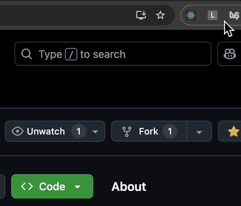

# LoveMaker-ChromeExtension Hackathon
Won 1st Place in CodeSmith 2024 annual Hackathon. LoveMaker is a fun and quick chrome extension

## Prompt
In less than 4 hours, create a chrome extension that makes great impact to our engineers.

## Demo

    
How to use the extension

    

## Installation
Download the zip file and extract. Go to Chrome Extension Store and upload the file (including the manifest.json). Pin the extension and click to generate pickup lines.

## Lesson & Impact
- I learned about using the APIs and how to use the fetch method via GET/POST to send and receive requests from the client to the server.
- Not all APIs will be approved/connected. For example, LinkedIn's API needs approval to use.
